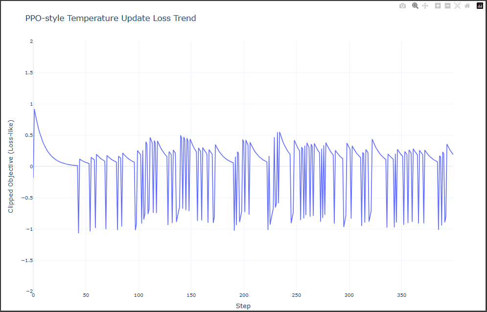

PPO 방식을 적용하여 temperature와 top p를 합친 Objective를 튜닝

1. temperature 값을 0.3, top_p 값을 0.9로 고정하고 200개 테스트를 돌린 결과: 181/200

2. PPO 방식을 적용하여 
temperature 값을 0.4458, top_p 값을 0.9680 으로 최적화하고 200개 테스트를 돌린 결과: 185/200

Loss 값이 안정적으로 수렴하진 않음