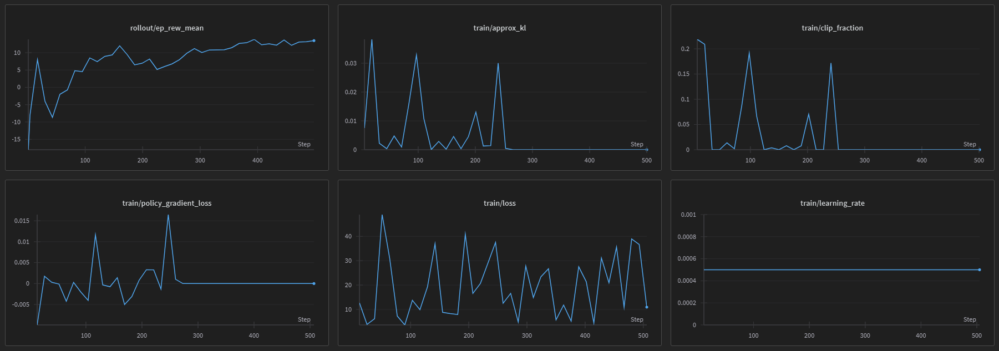

# Temperature tuning with Reinforcement learning


## 데이터

- `train.csv`: GPT로 생성한 [데이터셋](/data/train.csv) 400개 (학습용)
- `Test_Data_Answer_200.csv`: 대회 측 데이터 201개 (평가용)

## 학습 결과

|Policy|Accuracy|
|:---:|:---:|
|sm|76.1%|
|md|74.9%|
|random|70.1%|

### policy-sm



```text
Episode 1:
  Episode reward: 105.000
  Average temperature: 0.000

Episode 2:
  Episode reward: 107.000
  Average temperature: 0.000

==============================
EVALUATION RESULTS
==============================
Average episode reward: 106.000 ± 1.000
Average temperature: 0.000 ± 0.000
```

모든 프롬프트에 대해 0에 가까운 temperature를 출력
